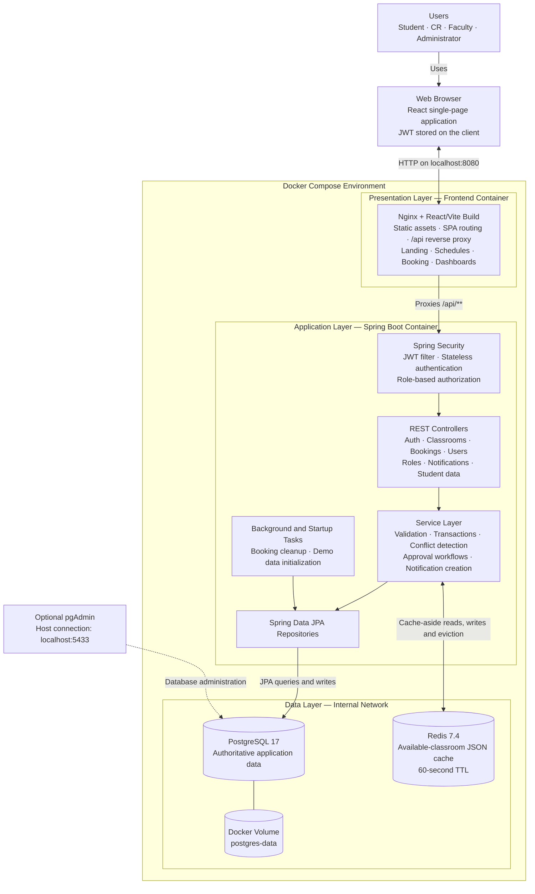

# UniSpace High-Level Architecture

UniSpace is a three-tier, containerized web application. The React frontend communicates with a Spring Boot REST API through Nginx. PostgreSQL is the source of truth, while Redis provides a disposable cache for the available-classroom catalogue.

## Main Request Flows

### Authentication

1. The browser sends the email and password to `POST /api/auth/login`.
2. Spring Security delegates credential verification to the configured authentication manager and user-details service.
3. After successful authentication, the backend signs and returns a JWT.
4. The frontend sends the token in the `Authorization: Bearer ...` header on protected requests.
5. The JWT filter validates the token, loads the current user, and establishes the Spring Security context.
6. Endpoint rules authorize the request according to the user's database roles.

### Booking and Conflict Prevention

1. A class representative selects a strict schedule slot and submits a booking request.
2. The service validates the classroom, faculty, date, course and published slot.
3. PostgreSQL places a pessimistic write lock on the classroom row.
4. The service checks recurring routines and pending or approved bookings for time overlap.
5. The booking and its user-specific notifications are committed in one transaction.
6. Approval repeats conflict validation, while a PostgreSQL exclusion constraint provides final protection against overlapping approved bookings.

### Classroom Catalogue Caching

1. `GET /api/classrooms` checks Redis for the available-classroom snapshot.
2. A cache hit is deserialized and returned without querying PostgreSQL.
3. A cache miss queries PostgreSQL, returns the result and stores it in Redis for 60 seconds.
4. Classroom creation or modification evicts the snapshot after the database transaction commits.
5. Redis failures fall back to PostgreSQL; booking validation never relies on cached data.

## Architectural Characteristics

- **Style:** Layered modular monolith with REST APIs.
- **Frontend:** React and TypeScript, built by Vite and served by Nginx.
- **Backend:** Spring Boot with controller, service and repository layers.
- **Security:** Stateless JWT authentication and role-based endpoint authorization.
- **Persistence:** PostgreSQL with transactional integrity and database-level booking constraints.
- **Caching:** Redis cache-aside catalogue cache; disposable and non-authoritative.
- **Deployment:** Four Docker Compose services: frontend, backend, PostgreSQL and Redis.
- **Availability:** Redis is optional; PostgreSQL is required and persists through a named Docker volume.
